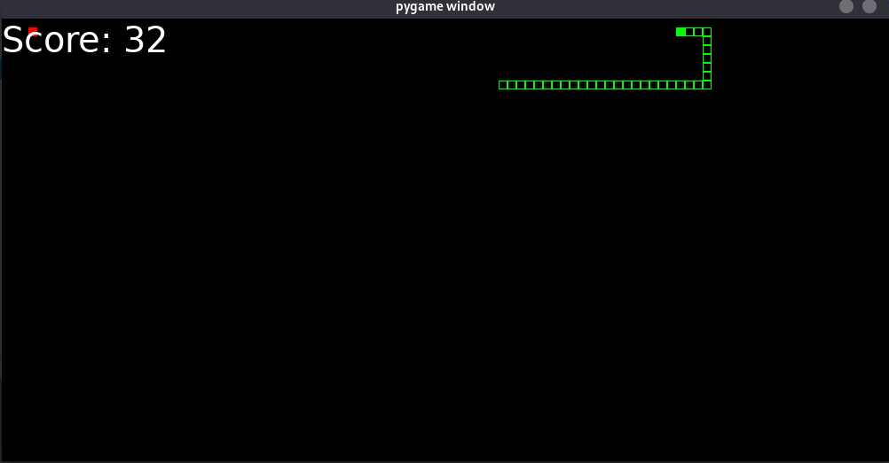
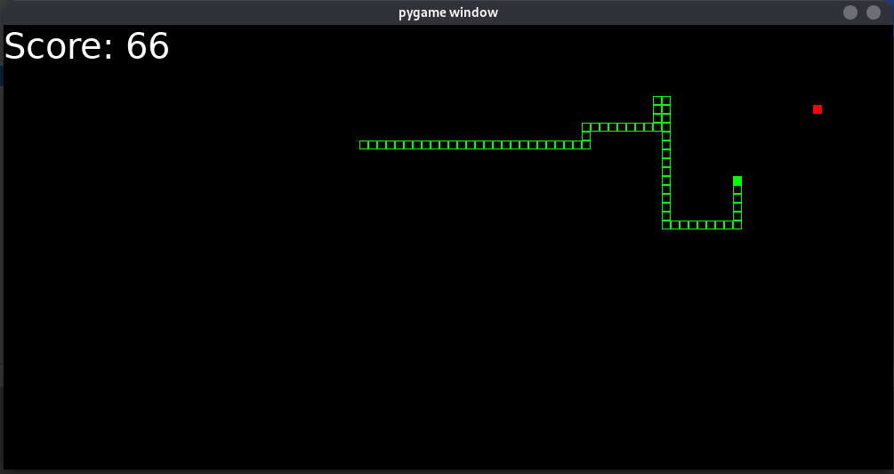
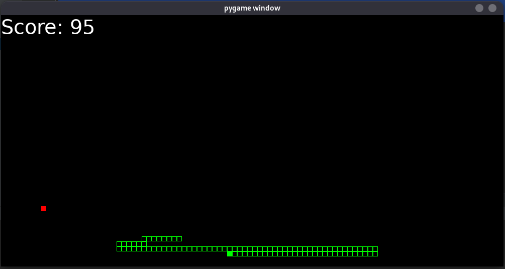
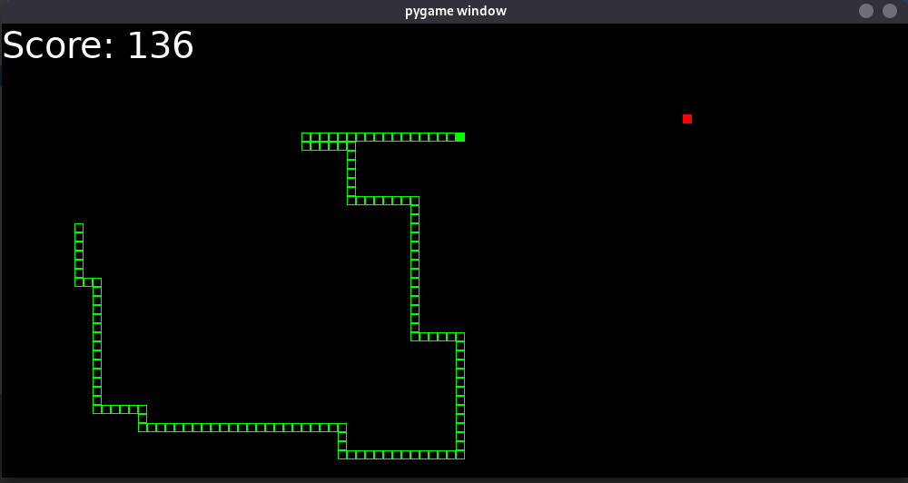
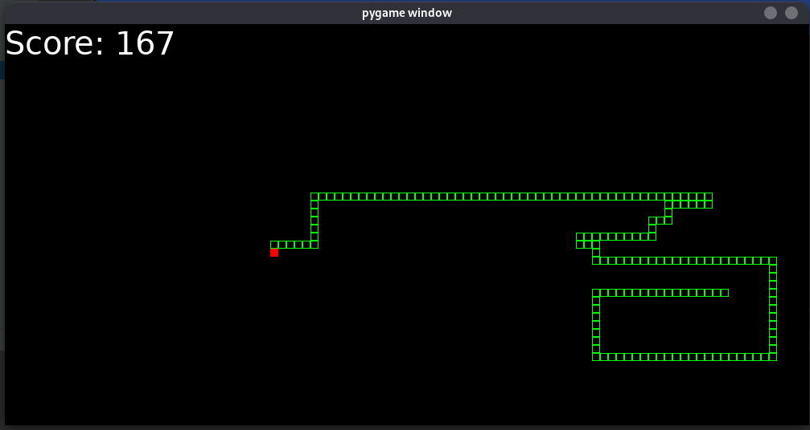

# Introduction:
---------------------------------
- Auto snake is an AI Game that make the snake able to play by itself to make max score to win the game using traditional algorithms to find the path between two points like A*, BFS, dijkstra, ...
- the game structure make you able to make your algorithm and apply it easly to the game all you need to implement one class and see the magic.

# Prerequisite:
---------------------------------
- python3
- pygame library

## Usage:
---------------------------------
```python
# the main function 
from Game import Game
from BFS import Bfs
from Dijikstra import Dijikstra
from Astar import AStar
if __name__ == '__main__':
	# Algorithms initialization
	bfs = Bfs(None, None, None)
	a_star = AStar(None, None, None)
	dij = Dijikstra(None, None, None)

	# pass the algorithm you need to run to the game class
	game = Game(bfs, 1000, 500)

	# start the game
	game.start()
```

## Make your algorithm:
---------------------------------
```python
# inherit the Wlaker class
class MyAlog(Walker):
	# implement get_next_direction method
	def get_next_direction(self):
		pass
```

# Note:
---------------------------------
- the get_next_direction method should return Direction Object
- the Direction class available in Snake class
## Direction Class:
```python
from enum import Enum

class Direction(Enum):
    NONE = -1
    UP = 0
    DOWN = 1
    LEFT = 2
    RIGHT = 3
```

# Images
---------------------------------
<p align="center"></p>
<p align="center"></p>
<p align="center"></p>
<p align="center"></p>
<p align="center"></p>


## License
[MIT](https://choosealicense.com/licenses/mit/)

